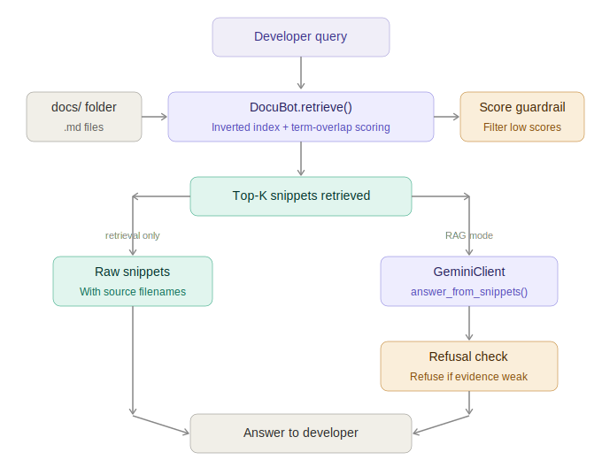

# DocuBot

**Base project:** DocuBot (Module 4 Tinker Activity)  
Original DocuBot was a lightweight RAG-based documentation assistant that answered developer questions by retrieving relevant snippets from markdown files and grounding Gemini's responses in those snippets. It supported three modes: naive LLM, retrieval only, and RAG.

---

## What It Does

DocuBot answers developer questions about a codebase by retrieving relevant documentation snippets and using Gemini to synthesize grounded answers. It is designed to reduce hallucinations compared to naive LLM generation.

---

## Demo Walkthrough

🎥 Loom video: [ADD LINK HERE AFTER RECORDING]

### Sample Interactions

**Input 1:** "Where is the auth token generated?"  
**Output (RAG):** "The auth token is generated by the `generate_access_token` function in `auth_utils.py`, signed using `AUTH_SECRET_KEY`. (Source: AUTH.md)"

**Input 2:** "How do I connect to the database?"  
**Output (RAG):** "The database connection is determined by the `DATABASE_URL` environment variable. SQLite is used by default. (Source: DATABASE.md)"

**Input 3:** "Is there any mention of payment processing?"  
**Output (RAG):** "I do not know based on the docs I have."

---

## System Architecture



---

## Setup

### 1. Install dependencies
```bash
pip install -r requirements.txt
```

### 2. Configure environment
```bash
cp .env.example .env
# Add your Gemini API key to .env
GEMINI_API_KEY=your_key_here
```

### 3. Run DocuBot
```bash
python main.py
```

### 4. Run evaluation
```bash
python evaluation.py
```

### 5. Run tests
```bash
python -m pytest tests/
```

---

## Design Decisions

- **Paragraph chunking over whole-document retrieval:** Returns more precise snippets, reducing noise sent to the LLM.
- **Score threshold guardrail:** Chunks scoring ≤ 1 are discarded before reaching the LLM, preventing low-confidence answers.
- **Explicit refusal over guessing:** The LLM is instructed to say "I do not know" rather than hallucinate when evidence is weak.
- **Term-overlap scoring over embeddings:** Simpler and faster, no external dependencies — tradeoff is missed synonyms.

---

## Testing Summary

6/6 pytest tests pass covering retrieval correctness, refusal behavior, and error handling. Evaluation harness shows retrieval hit rate across 8 sample queries. Known weakness: term-overlap misses synonyms (e.g. "lists" vs "returns"), causing occasional retrieval failures.

---

## Reflection

Building DocuBot showed that RAG is only as good as its retrieval step — a confident-sounding answer grounded in the wrong snippet is worse than a refusal. The guardrail threshold and explicit refusal instruction were the most impactful reliability improvements. The biggest limitation is term-overlap scoring; semantic embeddings would significantly improve recall.

---

## Ethics and Limitations

- **Limitations:** Term-overlap scoring misses synonyms; paragraph chunking can split related content; outdated docs produce confidently wrong answers.
- **Misuse risk:** Developers could over-trust RAG answers for security-critical configuration. Mitigation: always cite sources and show refusals clearly.
- **AI collaboration:** Gemini helped draft prompt wording. One helpful suggestion: the explicit "I do not know" refusal instruction. One flawed suggestion: Gemini initially recommended removing the score threshold entirely, which would have surfaced irrelevant noise.
